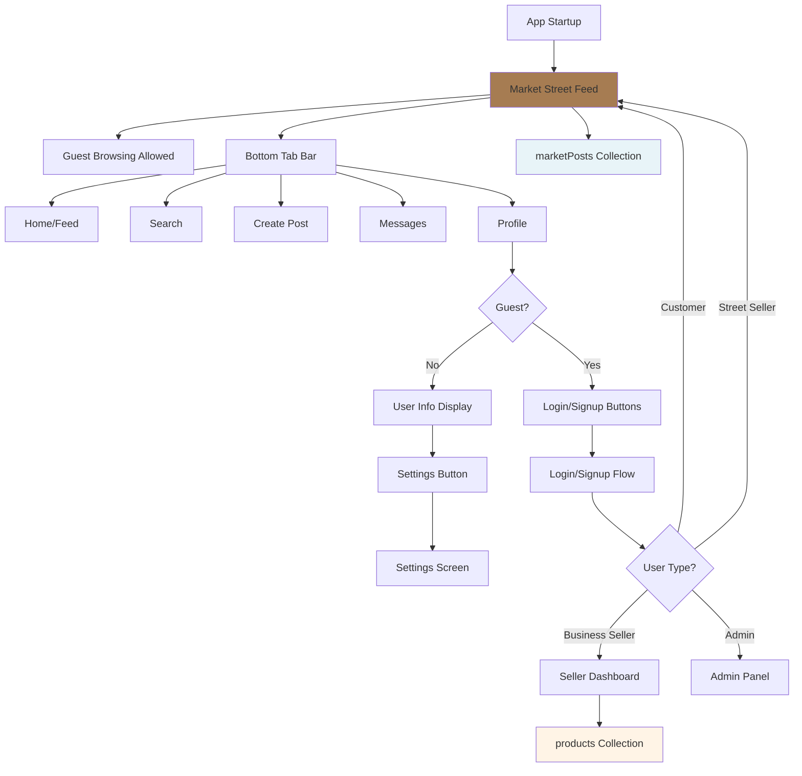

# Market Street Layer - Full Implementation Plan

## Overview

Market Street is a TikTok-style discovery feed that becomes the default startup experience. Users can browse as guests, and login/signup is only accessible from the Profile tab. The system maintains strict separation between Market Street posts (`marketPosts` collection) and business seller products (`products` collection).

## Architecture Diagram



## File Structure Changes

### New Files to Create

```
app/
  (market)/                           # NEW: Market Street navigation group
    _layout.tsx                       # Tab layout with CustomTabBar
    index.tsx                         # Feed screen (Home tab)
    search.tsx                        # Search/Hashtags screen
    create-post.tsx                   # Batch upload (1-20 images)
    messages/                         # Messaging folder
      index.tsx                       # Messages list
      [chatId].tsx                    # Chat detail screen
    profile.tsx                       # Profile screen
    settings.tsx                      # Settings screen (logged-in users)
    post/                             # Post detail folder
      [id].tsx                        # Post detail/chat screen
    
lib/
  firebase/
    firestore/
      market-posts.ts                 # NEW: Market Post hooks
      market-messages.ts              # NEW: Market messaging hooks
      market-comments.ts              # NEW: Market comments hooks
  
  api/
    market-posts.ts                   # NEW: Market Post API calls
    market-messages.ts                # NEW: Market messaging API
    market-comments.ts                # NEW: Market comments API
    
types/
  index.ts                            # UPDATE: Add MarketPost, MarketMessage types
  
components/
  market/
    feed-card.tsx                     # NEW: Full-screen feed card component
    post-overlay.tsx                  # NEW: Product info overlay (price, seller, actions)
    comment-item.tsx                  # NEW: Comment component
    message-bubble.tsx                # NEW: Chat message bubble
    batch-image-picker.tsx            # NEW: 1-20 image picker component
    hashtag-input.tsx                 # NEW: Hashtag input with suggestions
```

### Files to Modify

- `app/_layout.tsx` - Update routing logic for Market Street as default
- `types/index.ts` - Add MarketPost, MarketMessage, MarketComment types
- `lib/utils/auth-helpers.ts` - Add helper functions for Market Street access
- `lib/firebase/auth/use-user.ts` - Add sellerType support (optional for now)
- `app/(auth)/login.tsx` - Update to support Market Street routing
- `app/(auth)/signup.tsx` - Update to support Market Street routing

## Data Model

### MarketPost Type

```typescript
// types/index.ts
export interface MarketPost {
  id?: string;
  posterId: string;              // Firebase Auth UID
  images: string[];              // 1-20 image URLs (required)
  hashtags?: string[];           // Optional hashtags
  price?: number;                // Optional price (NGN)
  description?: string;          // Optional description
  location?: {
    state?: string;
    city?: string;
  };
  contactMethod?: 'in-app' | 'whatsapp';
  
  // Engagement
  likes: number;                 // Like count
  views: number;                 // View count
  comments: number;              // Comment count
  likedBy?: string[];            // User IDs who liked
  
  // Status
  status: 'active' | 'hidden' | 'deleted';
  
  // Timestamps
  createdAt: Timestamp | Date;
  updatedAt: Timestamp | Date;
  expiresAt?: Timestamp | Date;  // Optional auto-hide
}
```

### MarketMessage Type

```typescript
export interface MarketMessage {
  id?: string;
  chatId: string;                // Unique chat ID (buyerId_posterId_postId)
  senderId: string;              // Sender Firebase UID
  receiverId: string;            // Receiver Firebase UID
  postId: string;                // Related Market Post ID
  message: string;               // Message text
  imageUrl?: string;             // Optional image in message
  paymentLink?: string;          // Optional payment link
  read: boolean;                 // Read status
  
  // Timestamps
  createdAt: Timestamp | Date;
}
```

### MarketComment Type

```typescript
export interface MarketComment {
  id?: string;
  postId: string;                // Market Post ID
  userId: string;                // Commenter Firebase UID
  comment: string;               // Comment text
  
  // Timestamps
  createdAt: Timestamp | Date;
  updatedAt?: Timestamp | Date;
}
```

## Implementation Phases

### Phase 1: Foundation & Routing

**1.1 Update App Routing (`app/_layout.tsx`)**

- Change default anchor from `(tabs)` to `(market)` in `unstable_settings`
- Update routing logic:
  - No user → Route to `(market)/index` (guest browsing allowed)
  - User logged in → Route based on user type:
    - Customer/Street Seller → `(market)/index`
    - Business Seller → `(tabs)/index` 
    - Admin → `(admin)/index`
- Remove login redirect on startup (allow guest access to Market Street)
- Add `(market)` to Stack.Screen routes

**1.2 Create Market Navigation Group (`app/(market)/_layout.tsx`)**

- Tab layout using CustomTabBar (reuse existing component from `components/custom-tab-bar.tsx`)
- 5 tabs: Home (index), Search, Create Post, Messages, Profile
- Icons:
  - Home: `house.fill` / `house`
  - Search: `magnifyingglass`
  - Create: `plus.circle.fill` (center button in CustomTabBar)
  - Messages: `message.fill` / `message`
  - Profile: `person.fill` / `person`
- Hide Create tab from tab bar (handled by center button)

**1.3 Add Types (`types/index.ts`)**

- Add `MarketPost` interface
- Add `MarketMessage` interface  
- Add `MarketComment` interface
- Add `SellerType?: 'business' | 'street' | 'both'` to User interface (optional for backward compatibility)

**1.4 Update Auth Helpers (`lib/utils/auth-helpers.ts`)**

- Add `canAccessMarketStreet(user)` - Returns true for guests (null user) or any logged-in user
- Add `canPostToMarketStreet(user)` - Returns true if logged in (customer, street seller, or both)
- Keep existing `hasAppAccess` for business seller/admin access unchanged

### Phase 2: Feed Screen (TikTok-Style)

**2.1 Create Feed Screen (`app/(market)/index.tsx`)**

- Full-screen FlatList with vertical scrolling
- Use `Dimensions.get('window').height` for `snapToInterval`
- `pagingEnabled={true}` for snap-to-page behavior
- `showsVerticalScrollIndicator={false}`
- `decelerationRate="fast"` for smooth snapping
- Pull-to-refresh support with RefreshControl
- Infinite scroll with `onEndReached` and pagination
- Guest browsing allowed (no login required to view feed)
- Loading state with skeleton cards
- Empty state when no posts available

**2.2 Create Feed Card Component (`components/market/feed-card.tsx`)**

- Full-screen card (100% width and height)
- Image gallery support (swipe horizontally through 1-20 images)
- Use `SafeImage` component for image loading with error handling
- Image container with `StyleSheet.absoluteFill` for full coverage
- Gradient overlay at bottom for text readability
- Product info overlay (bottom-left) showing:
  - Price (if exists) or "Ask for Price" button
  - Post description (if exists)
  - Seller name/username
- Action buttons overlay (bottom-right) showing:
  - Like button (heart icon) with like count
  - Comment button (message icon) with comment count
  - Share button (share icon)
- Image pagination dots (if multiple images) at bottom-center
- Horizontal ScrollView for image gallery (1-20 images)
- Use `LinearGradient` from `expo-linear-gradient` for bottom gradient overlay
- Use `AnimatedPressable` for interactive buttons
- Haptic feedback on button presses
- "Ask for Price" button opens messaging screen (requires login, show login prompt if guest)

**2.3 Create Post Overlay Component (`components/market/post-overlay.tsx`)**

- Reusable overlay component for product info display
- Props: `post`, `onLike`, `onComment`, `onShare`, `onAskForPrice`
- Handles price display logic (show price or "Ask for Price" button)
- Fetches seller info using `usePublicUserProfile` hook
- Gradient background using `LinearGradient`
- Responsive text sizing for different screen sizes

**2.4 Create Market Posts Hook (`lib/firebase/firestore/market-posts.ts`)**

- `useMarketPosts()` - Fetch paginated Market Street posts
  - Query: `where('status', '==', 'active')` + `orderBy('createdAt', 'desc')`
  - Real-time updates with `onSnapshot`
  - Pagination support with `startAfter` and `limit`
  - Returns: `{ posts, loading, error, loadMore, hasMore, refresh }`
- `useMarketPost(id)` - Fetch single Market Post
  - Real-time updates
  - Returns: `{ post, loading, error }`
- `useMarketPostLikes(postId)` - Track likes for a post
  - Real-time updates of like count and likedBy array
  - Returns: `{ likes, likedBy, isLiked, loading }`

**2.5 Create Market Posts API (`lib/api/market-posts.ts`)**

- `marketPostsApi.create(data)` - Create new Market Post
  - Requires authentication
  - Uploads 1-20 images to Firebase Storage
  - Creates document in `marketPosts` collection
  - Returns created post
- `marketPostsApi.like(postId)` - Like/unlike a post
  - Requires authentication
  - Updates `likes` count and `likedBy` array
- `marketPostsApi.delete(postId)` - Delete a post (poster only)
  - Requires authentication
  - Verifies poster ownership
- `marketPostsApi.incrementViews(postId)` - Increment view count
  - Can be called by guests (no auth required)
  - Uses Firestore increment operation

### Phase 3: Post Creation & Batch Upload

**3.1 Create Batch Image Picker Component (`components/market/batch-image-picker.tsx`)**

- Image picker supporting 1-20 images
- Uses `expo-image-picker` with `launchImageLibraryAsync`
- Image preview grid with drag-to-reorder support
- Remove image functionality
- Image count indicator (e.g., "5/20 images")
- Validation: minimum 1 image, maximum 20 images
- Image compression before upload

**3.2 Create Hashtag Input Component (`components/market/hashtag-input.tsx`)**

- Text input with hashtag parsing
- Auto-complete suggestions from trending hashtags
- Display hashtags as chips/tags
- Remove hashtag functionality
- Validation: max hashtags (e.g., 10)
- Fetch trending hashtags from Firestore `trendingHashtags` collection

**3.3 Create Post Creation Screen (`app/(market)/create-post.tsx`)**

- Multi-step form:
  - Step 1: Image selection (1-20 images) using BatchImagePicker
  - Step 2: Details (hashtags, optional price, description, location)
- Navigation: Login required (redirect to login if guest)
- Form validation before submission
- Loading state during upload
- Success navigation back to feed
- Error handling with toast notifications

**3.4 Update Market Posts API for Creation**

- Extend `marketPostsApi.create()` to handle:
  - Multiple image uploads (1-20)
  - Image compression and optimization
  - Hashtag processing and storage
  - Optional price validation
  - Location data storage
  - Contact method selection

### Phase 4: Interactions (Likes, Comments, Messages)

**4.1 Create Comment Item Component (`components/market/comment-item.tsx`)**

- Display comment text and user info
- Timestamp formatting (relative time)
- Delete button (for comment owner)
- User avatar/initial
- Real-time updates

**4.2 Create Market Comments Hook (`lib/firebase/firestore/market-comments.ts`)**

- `useMarketPostComments(postId)` - Fetch comments for a post
  - Real-time updates with `onSnapshot`
  - Ordered by `createdAt` descending
  - Returns: `{ comments, loading, error }`

**4.3 Create Market Comments API (`lib/api/market-comments.ts`)**

- `marketCommentsApi.create(postId, comment)` - Add comment
  - Requires authentication
  - Creates document in `marketPostComments` collection
  - Increments comment count on post
- `marketCommentsApi.delete(commentId)` - Delete comment
  - Requires authentication
  - Verifies comment owner
  - Decrements comment count on post

**4.4 Create Post Detail Screen (`app/(market)/post/[id].tsx`)**

- Full-screen post view with comments section
- Comment input at bottom
- Scrollable comments list
- Like functionality
- Share functionality
- "Ask for Price" button (opens messaging)
- Navigation back to feed

**4.5 Create Message Bubble Component (`components/market/message-bubble.tsx`)**

- Chat message display (sent/received)
- Image message support
- Payment link display
- Timestamp formatting
- Read status indicator

**4.6 Create Market Messages Hook (`lib/firebase/firestore/market-messages.ts`)**

- `useMarketChats(userId)` - Fetch user's chat list
  - Returns list of chats with last message preview
  - Real-time updates
- `useMarketChat(chatId)` - Fetch messages for a chat
  - Real-time updates with `onSnapshot`
  - Ordered by `createdAt` ascending
  - Returns: `{ messages, loading, error, sendMessage }`

**4.7 Create Market Messages API (`lib/api/market-messages.ts`)**

- `marketMessagesApi.createChat(buyerId, posterId, postId)` - Create chat
  - Generates unique chatId: `${buyerId}_${posterId}_${postId}`
  - Creates document in `marketChats` collection
- `marketMessagesApi.sendMessage(chatId, message, imageUrl?, paymentLink?)` - Send message
  - Requires authentication
  - Creates document in `marketMessages` subcollection
  - Updates chat lastMessage and timestamp
- `marketMessagesApi.markAsRead(chatId, messageIds)` - Mark messages as read

**4.8 Create Messages List Screen (`app/(market)/messages/index.tsx`)**

- List of user's chats
- Last message preview
- Unread message count badge
- Navigation to chat detail
- Empty state when no chats
- Login required (redirect if guest)

**4.9 Create Chat Detail Screen (`app/(market)/messages/[chatId].tsx`)**

- Message list with real-time updates
- Message input at bottom
- Image picker for image messages
- Payment link sharing
- WhatsApp redirect warning (if contactMethod is whatsapp)
- KeyboardAvoidingView for input

### Phase 5: Profile & Settings

**5.1 Create Profile Screen (`app/(market)/profile.tsx`)**

- Guest state:
  - Welcome message
  - "Login" button → Navigate to `(auth)/login`
  - "Sign Up" button → Navigate to `(auth)/signup`
  - Info about Market Street features
- Logged-in state:
  - User info display (avatar, name, email)
  - User's posts count
  - User's likes count
  - Settings button → Navigate to `settings.tsx`
  - Logout button
- Use floating island design (consistent with seller UI)
- Light brown accent color (#A67C52)

**5.2 Create Settings Screen (`app/(market)/settings.tsx`)**

- Account settings:
  - Edit profile (name, email, phone)
  - Change password
  - Profile picture upload
- App settings:
  - Theme toggle (dark/light)
  - Notifications preferences
- About section:
  - App version
  - Terms of service link
  - Privacy policy link
- Logout button
- Use floating island design

**5.3 Update Login/Signup Screens**

- Update `app/(auth)/login.tsx`:
  - After successful login, route based on user type:
    - Customer/Street Seller → `(market)/index`
    - Business Seller → `(tabs)/index`
    - Admin → `(admin)/index`
- Update `app/(auth)/signup.tsx`:
  - Add user type selection (Customer, Street Seller, Business Seller)
  - Set `sellerType` field in user document
  - Route to appropriate screen after signup

### Phase 6: Search & Discovery

**6.1 Create Search Screen (`app/(market)/search.tsx`)**

- Search input with hashtag support
- Trending hashtags section
- Recent searches (stored in AsyncStorage)
- Search results:
  - Posts matching search query
  - Hashtag filtering
  - Location filtering
- Empty state when no results

**6.2 Create Search Functionality**

- Extend `useMarketPosts()` hook with search filter
- Firestore query: `where('hashtags', 'array-contains', searchTerm)`
- Text search in description field (requires Algolia or similar, or client-side filtering)
- Location-based search (if location provided)

### Phase 7: Backend Cloud Functions

**7.1 Create Market Post Cloud Functions**

- `createMarketPost` - Create post with image uploads
  - Validates image count (1-20)
  - Uploads images to Firebase Storage
  - Creates Firestore document
  - Returns post data
- `likeMarketPost` - Like/unlike post
  - Updates like count atomically
  - Updates likedBy array
- `deleteMarketPost` - Delete post
  - Verifies poster ownership
  - Deletes images from Storage
  - Deletes Firestore document
- `incrementPostViews` - Increment view count
  - Public endpoint (no auth required)
  - Uses Firestore increment

**7.2 Create Market Comment Cloud Functions**

- `createMarketComment` - Add comment
  - Validates comment text
  - Creates comment document
  - Increments post comment count
- `deleteMarketComment` - Delete comment
  - Verifies comment owner
  - Deletes comment document
  - Decrements post comment count

**7.3 Create Market Message Cloud Functions**

- `createMarketChat` - Create chat
  - Generates unique chatId
  - Creates chat document
  - Returns chat data
- `sendMarketMessage` - Send message
  - Validates message content
  - Handles image uploads if present
  - Creates message document
  - Updates chat lastMessage
  - Sends push notification to receiver

### Phase 8: Polish & Optimization

**8.1 Performance Optimization**

- Image lazy loading in feed
- Image caching with `expo-image`
- Pagination optimization (load 10-15 posts at a time)
- Memoization of feed cards
- Optimize FlatList with `getItemLayout` if possible

**8.2 Error Handling**

- Network error handling
- Image load error handling
- API error handling with user-friendly messages
- Offline state handling
- Retry mechanisms for failed operations

**8.3 Animations & Transitions**

- Smooth feed scrolling animations
- Like button animation (scale + fill)
- Image transition animations
- Screen transition animations
- Loading skeleton animations

**8.4 Testing & Edge Cases**

- Test with 1 image post
- Test with 20 image post
- Test with no price (Ask for Price flow)
- Test guest browsing
- Test login flow from profile
- Test all user types (customer, street seller, business seller, admin)
- Test empty states
- Test error states

## Summary

This plan implements a complete Market Street layer with TikTok-style feed, guest browsing, batch posting, interactions (likes, comments, messages), and profile management. The system maintains strict separation from business seller products while providing a seamless user experience for casual sellers and buyers.